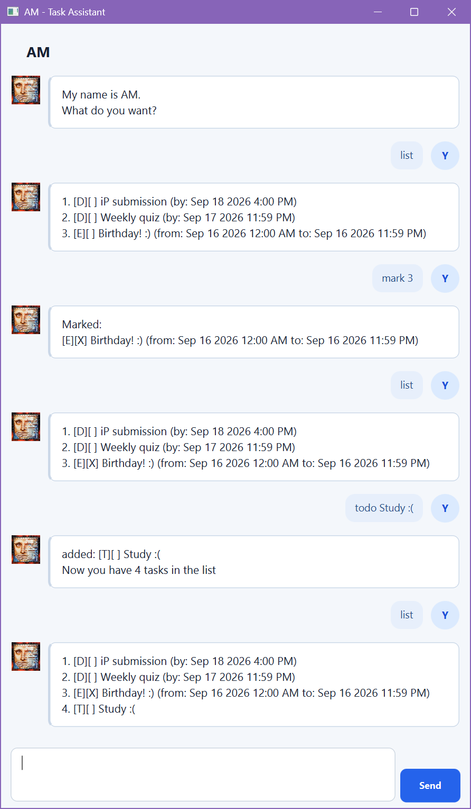

# AM


## User Guide

> My name is AM. What do you want?

AM is a desktop chatbot that keeps track of your todos, deadlines, and events.
Type a command to add a task, find something in your list, update its details,
or mark it as done. AM saves your tasks locally for your next session.

**Jump to:** [Getting started](#getting-started) · [Command reference](#command-reference) ·
[Dates and times](#dates-and-times) · [Saving your tasks](#saving-your-tasks) ·
[Troubleshooting](#troubleshooting) · [AI Usage Disclaimer](#ai-usage-disclaimer)

## Getting started

### Launch AM

1. Install **JDK 25** and check that `java -version` reports version 25.
2. Place `AM.jar` in a folder where you want to keep your tasks.
3. Open a terminal in that folder and run:

   ```shell
   java -jar AM.jar
   ```

4. In AM's window, type one command into the input box and press **Enter** or
   click **Send**.

<details markdown="block">
<summary>Need to build AM.jar from the source code?</summary>

Download or clone the [AM repository](https://github.com/bevanpoh/ip), then open
a terminal in the project folder containing `build.gradle`. With JDK 25 selected,
run the command for your system. The first build needs an internet connection
to download Gradle and its dependencies.

**Windows (PowerShell):**

```powershell
.\gradlew.bat shadowJar
```

**macOS / Linux:**

```shell
./gradlew shadowJar
```

The build creates `build/libs/AM.jar`. Copy it to the folder you want to use for
AM, then follow the launch instructions above.

</details>

<details markdown="block">
<summary>Prefer using a terminal?</summary>

From the folder containing `AM.jar`, launch the console interface with:

```shell
java -cp AM.jar am.Am
```

The console accepts the same task commands. Enter one command per line and use
`bye` to end the session.

</details>

<details markdown="block">
<summary>See AM in action</summary>



</details>

### Try your first commands

Enter these commands **one at a time**:

```text
todo buy milk
deadline submit report /by 2026-09-18 1800
event project meeting /from 2026-09-18 1400 /to 2026-09-18 1600
list
```

If you started with an empty list, AM shows:

```text
1. [T][ ] buy milk
2. [D][ ] submit report (by: Sep 18 2026 6:00 PM)
3. [E][ ] project meeting (from: Sep 18 2026 2:00 PM to: Sep 18 2026 4:00 PM)
```

Try `mark 1` to complete the todo, or `edit 3 /to 1800` to extend the meeting.
If you already have tasks, use the numbers shown by your latest `list` instead.

### Read a task

| Part | Meaning |
| --- | --- |
| `1.` | The task's current number in the full list |
| `[T]` | Todo: a task without a date |
| `[D]` | Deadline: a task with a due date and time |
| `[E]` | Event: a task with a start and end |
| `[ ]` | Incomplete |
| `[X]` | Complete |

The examples use English date displays. Month names and AM/PM text may vary
with your system's language settings.

### Read the command syntax

- Words in capitals, such as `DESCRIPTION` and `INDEX`, are placeholders.
  Replace them with your own values.
- Square brackets in a **syntax line** mean an optional field. Do not type
  those brackets. The brackets in AM's task displays are status symbols.
- Commands and markers are case-sensitive: use `list` and `/by`, with the
  lowercase spelling shown here.
- `INDEX` is a positive whole-number task number from the current list,
  starting at **1**. Run `list` whenever you need to check it.
- Leading and trailing whitespace is ignored. Extra spaces between arguments
  are accepted; spacing inside a description is preserved.
- Descriptions must contain text and cannot contain `|` or line breaks.
  You do not need quotation marks around a description with spaces.
- For `deadline`, `event`, and `edit`, a token starting with `/` after whitespace
  is treated as a marker. Use only supported markers, once each, with a value.
  Embedded slashes such as `read/write` work; `edit 1 /name inspect /tmp` does
  not. Quoting or escaping does not bypass marker parsing.
- Send one command at a time. Blank input is ignored. In the window, pasted
  line breaks and tabs are removed, so submit examples separately.

## Command reference

| Action | Syntax | Example |
| --- | --- | --- |
| [Add a todo](#add-a-todo) | `todo DESCRIPTION` | `todo buy milk` |
| [Add a deadline](#add-a-deadline) | `deadline DESCRIPTION /by DATE [TIME]` | `deadline submit report /by 2026-09-18 1800` |
| [Add an event](#add-an-event) | `event DESCRIPTION /from DATE [TIME] /to DATE [TIME]` | `event project meeting /from 2026-09-18 1400 /to 2026-09-18 1600` |
| [List all tasks](#list-all-tasks) | `list` | `list` |
| [Find tasks](#find-tasks) | `find KEYWORD` | `find report` |
| [Show past tasks](#show-past-tasks) | `past` | `past` |
| [Mark a task as done](#mark-a-task-as-done) | `mark INDEX` | `mark 1` |
| [Mark a task as incomplete](#mark-a-task-as-incomplete) | `unmark INDEX` | `unmark 1` |
| [Edit a task](#edit-a-task) | `edit INDEX [/name DESCRIPTION] [/by VALUE] [/from VALUE] [/to VALUE]` | `edit 3 /to 1800` |
| [Delete a task](#delete-a-task) | `delete INDEX` | `delete 1` |
| [End the session](#end-the-session) | `bye` | `bye` |

`DATE` uses `yyyy-MM-dd`; `TIME` uses four digits in 24-hour time, such as `0900`
or `1800`. See [Dates and times](#dates-and-times) for defaults and edit values.

### Add a todo

Create a task without a date or time.

**Syntax:** `todo DESCRIPTION`

```text
todo buy milk
```

For an initially empty list, AM replies:

```text
added: [T][ ] buy milk
Now you have 1 tasks in the list
```

New tasks are incomplete and appear at the end of the list. AM allows duplicate
descriptions, so entering an add command twice creates two tasks.

### Add a deadline

Create a task with a due date and an optional time.

**Syntax:** `deadline DESCRIPTION /by DATE [TIME]`

```text
deadline submit report /by 2026-09-18 1800
```

The task appears as:

```text
[D][ ] submit report (by: Sep 18 2026 6:00 PM)
```

To specify only the day, use `deadline submit report /by 2026-09-18`.
AM sets the deadline to **11:59 PM** that day. `/by` is required.

### Add an event

Create a task with a start and end date, each with an optional time.

**Syntax:** `event DESCRIPTION /from DATE [TIME] /to DATE [TIME]`

```text
event project meeting /from 2026-09-18 1400 /to 2026-09-18 1600
```

The task appears as:

```text
[E][ ] project meeting (from: Sep 18 2026 2:00 PM to: Sep 18 2026 4:00 PM)
```

Both `/from` and `/to` are required, and may appear in either order. Set the
end at or after the start. For an overnight event, give `/to` the next day's
date explicitly.

For a whole-day event:

```text
event study day /from 2026-09-19 /to 2026-09-19
```

AM uses **12:00 AM** for the start and **11:59 PM** for the end.

### List all tasks

**Syntax:** `list`

```text
list
```

Shows every task in the order it was added, including completed and past tasks.
Each task has a number you can use with `mark`, `unmark`, `edit`, and `delete`.

If the list is empty, AM replies `I don't see anything`.

### Find tasks

**Syntax:** `find KEYWORD`

```text
find REPORT
```

Searches descriptions for matching text, ignoring letter case. For example,
`find REPORT` matches `submit report`, and `find port` also matches it.
You can search for a phrase, such as `find project meeting`; the phrase must
appear together in the description. Dates, task types, and completion symbols
are not searched.

With the tasks from the first-commands example, `find REPORT` returns:

```text
2. [D][ ] submit report (by: Sep 18 2026 6:00 PM)
```

**Results keep their full-list task numbers.** Use `edit 2 /name submit final report`
to rename this result, even though it is the only match. Searching does not
change the list or its numbering. Completed tasks can also match.

No matches produces `I don't see anything`.

### Show past tasks

**Syntax:** `past`

```text
past
```

Shows deadlines whose due time has passed and events whose **end** time has
passed, using your computer's current local date and time. An event that has
started but has not ended is not yet past.

- Both complete and incomplete tasks can appear.
- Todos never appear because they have no date.
- Results retain their full-list numbers, just like `find`.
- AM replies `I don't see anything` when there are no past tasks.

For example, after adding `deadline old report /by 2000-01-01`, use `past` to
find it. This is an on-demand view; AM does not send deadline notifications.

### Mark a task as done

**Syntax:** `mark INDEX`

```text
mark 1
```

If task 1 is `buy milk`, AM replies:

```text
Marked:
[T][X] buy milk
```

The task stays in the list with its status changed to `[X]`. You can complete
any of the three task types. Marking an already complete task keeps it complete.

### Mark a task as incomplete

**Syntax:** `unmark INDEX`

```text
unmark 1
```

If task 1 is `buy milk`, AM replies:

```text
Unmarked:
[T][ ] buy milk
```

Use this to reopen a task or correct an accidental `mark`. Unmarking an already
incomplete task keeps it incomplete.

### Edit a task

Change a task's description, dates, or times.

**Syntax:**

```text
edit INDEX [/name DESCRIPTION] [/by VALUE] [/from VALUE] [/to VALUE]
```

Supply **at least one field**. Fields can appear in any order, once each, but
must be supported by the selected task's type:

| Task type | Editable fields | Example |
| --- | --- | --- |
| Todo | `/name` | `edit 1 /name buy oat milk` |
| Deadline | `/name`, `/by` | `edit 2 /name submit final report /by 2026-09-19 1800` |
| Event | `/name`, `/from`, `/to` | `edit 3 /to 1800` |

Assuming task 3 is the meeting from the first-commands example, extend it with:

```text
edit 3 /to 1800
```

AM replies:

```text
Edited:
3. [E][ ] project meeting (from: Sep 18 2026 2:00 PM to: Sep 18 2026 6:00 PM)
```

To move both ends to a different day and rename the meeting in one command:

```text
edit 3 /to 2026-09-19 1700 /name planning session /from 2026-09-19 1500
```

**How edits behave:**

- Omitted fields keep their existing values.
- The task keeps its type, completion status, number, and list position.
  Completed and past tasks can be edited.
- Editing does not convert a todo into a deadline or event. Create a task of
  the desired type and delete the old one if you need a different type.
- For events, AM checks the final start and end together. The end must be at
  or after the start; equal times are allowed. Changing one end does not
  automatically change the other.
- If the result is identical to the existing task, AM replies `No changes.`.
- An invalid edit leaves the task unchanged.

For date-only and time-only edits, see the table below.

### Delete a task

**Syntax:** `delete INDEX`

```text
delete 1
```

If the list contains the three original example tasks and task 1 is incomplete,
AM replies:

```text
Deleted:
[T][ ] buy milk
Now you have 2 tasks in the list
```

Deletion removes the task immediately and saves the remaining list. There is
no undo command. Later tasks move up one number, so run `list` before your next
numbered command. Earlier chat messages still show the old numbers and details.

### End the session

**Syntax:** `bye`

```text
bye
```

AM replies:

```text
You may leave, but I will be here.
```

In the window, the input box and **Send** button become disabled, and AM shows
`Session ended. You can close this window.` Close the window when you are ready;
relaunch AM to enter more commands. In the console, `bye` exits the application.

## Dates and times

Use a real calendar date in **`yyyy-MM-dd`** format and four digits for a
24-hour time in **`HHmm`** format. For example, `2026-09-18 0900` means
18 September 2026 at 9:00 AM.

| Input value | When adding a deadline or event | When editing `/by`, `/from`, or `/to` |
| --- | --- | --- |
| `2026-09-18 1800` | Set that date and time | Replace both date and time |
| `2026-09-18` | Use that date with the default time below | Replace the date and reset to the default time below |
| `1800` | Not supported; include a date | Keep that field's existing date and replace its time |

| Field | Default time when only a date is supplied |
| --- | --- |
| `/by` (deadline) | 23:59, or 11:59 PM |
| `/from` (event start) | 00:00, or 12:00 AM |
| `/to` (event end) | 23:59, or 11:59 PM |

- Valid times range from `0000` to `2359`. Write `0900`, not `900` or `09:00`.
- AM accepts past dates. Relative words such as `today` and `tomorrow` are not
  supported.
- A time-only edit keeps the date of the **specific field** you edit. It never
  moves the time to another day automatically.
- Dates use your computer's local time; commands do not accept time zones.

## Saving your tasks

AM automatically saves after successful additions, edits, completion changes,
and deletions. There is no separate save command. An edit that returns
`No changes.` does not write to the file.

Tasks are stored in **`data/AM.txt` inside the folder from which you launch AM**.
AM creates the folder and file when it first saves a change, and loads saved
tasks when you use it again. Launching from a different folder uses a different
data file.

- Keep launching AM from the same folder to use the same task list.
- To move your tasks to another folder, close AM and copy the `data` folder
  along with `AM.jar`.
- Back up `data/AM.txt` if you want to keep a copy of your tasks. Each save
  replaces the file's contents with the current list.
- Chat history is not saved. Use `list` after reopening AM to see your tasks.

## Troubleshooting

In the window, errors appear under an **Error** heading. AM keeps invalid
arguments in the input box so you can correct and resubmit them. Unknown
commands, such as `LIST`, are cleared. Successful commands also clear the box.

| What you see | What it means and what to do |
| --- | --- |
| `You messed up the command.` followed by `Example: ...` | Check the command syntax, required values, task type, and date format. Use the supplied example as a template. |
| `You can't tell me to '...'` below AM's shout | The command name is unknown. Use a lowercase command from the [reference](#command-reference); there is no `help` command. |
| `Task N does not exist.` | Run `list` and choose a number in the displayed range. If the list is empty, add a task first. |
| `I don't see anything` | `list`, `find`, or `past` has no results. This is a normal response. |
| `No changes.` | Your edit would leave the task exactly as it is. Supply a different value to change it. |
| `I couldn't access my memory.` | AM could not read or save its task file. Check that the launch folder and `data/AM.txt` are accessible and writable. |
| `What did you do to my memory?` | AM detected malformed saved data. Close AM, keep a copy of `data/AM.txt`, and restore a known-good backup before reopening. |

### Correct an invalid command

For example, entering `deadline report /by tomorrow` produces:

```text
You messed up the command.
Example: deadline report /by 2026-09-12 1800
```

Replace `tomorrow` with the actual date you want, such as `2026-09-18`.
AM also rejects missing values, repeated or unsupported markers, invalid dates
such as `2026-02-30`, and task numbers such as `0`, `-1`, or `1.5`.
Task numbers must not exceed `2147483647`.

For edits, make sure the field belongs to the task type. For example,
`edit 1 /by 2026-09-18` fails if task 1 is a todo. An event edit also fails if
its final end is earlier than its start; move both ends together when needed.

### Recover from a save error

After a save error, a change may appear in the current session without being
stored successfully. An edit restores its previous in-memory task, but the
save operation can still leave the file incomplete. Check and back up the
existing file before restarting or retrying; use `list` to inspect the current
session, and check the list again after reopening AM to confirm what was saved.

## AI Usage Disclaimer
ChatGPT & Codex were heavily involved in developing this project, primarily in planning and 
implementing several features past the basic requirements _(such as comprehensive error handling, 
the UI, and improving architecture design)_, and in creating
documentation for this project _(such as docstrings and this very user guide)_.

[Back to top](#am)
